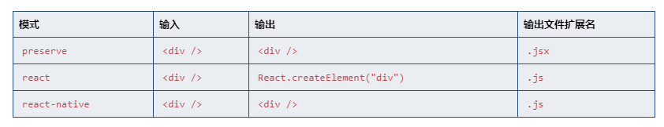

# tsconfig.json

## 文件的意义

如果一个目录下存在一个 tsconfig.json 文件，那么它意味着这个目录是 TypeScript 项目的根目录。 tsconfig.json 文件中指定了用来编译这个项目的根文件和编译选项。 一个项目可以通过以下方式之一来编译：

使用 tsconfig.json

1. 不带任何输入文件的情况下调用 tsc，编译器会从当前目录开始去查找 tsconfig.json 文件，逐级向上搜索父目录。
2. 不带任何输入文件的情况下调用 tsc，且使用命令行参数--project（或-p）指定一个包含 tsconfig.json 文件的目录。
3. 当命令行上指定了输入文件时，tsconfig.json 文件会被忽略。

`执行顺序：`
命令行 > 命令行指定的 tsconfig > 命令行指定了项目(-p), 则会去项目根目录找 tsconfig.json 配置文件 > 项目目录的 tsconfig.json > 默认配置

> 以上的总结：
> 一个 tsconfig.json 对应一个项目，如果想在一个文件夹内做多个项目，那就建立平行关系，每个项目拥有自己的 tsconfig.json 配置，不应该在平行项目的父级再添置 tscofig.json 文件，但可以提取公共部分到父级，但命名一定不是 tsconfig.json。

### jsx 编译属性

```json
{
  "compilerOptions": {
    "jsx": "preserve" // "react" "preact" "react-native"
  }
}
```

想要使用 JSX 必须做两件事：

- 给文件一个.tsx 扩展名
- 启用 jsx 选项

TypeScript 具有三种 JSX 模式：preserve，react 和 react-native。 这些模式只在代码生成阶段起作用 - 类型检查并不受影响。 在 preserve 模式下生成代码中会保留 JSX 以供后续的转换操作使用（比如：Babel）。 另外，输出文件会带有.jsx 扩展名。 react 模式会生成 React.createElement，在使用前不需要再进行转换操作了，输出文件的扩展名为.js。 react-native 相当于 preserve，它也保留了所有的 JSX，但是输出文件的扩展名是.js。



### --lib

### --module / -m

### 参考资料

1. [编译选项](https://www.tslang.cn/docs/handbook/compiler-options.html)
