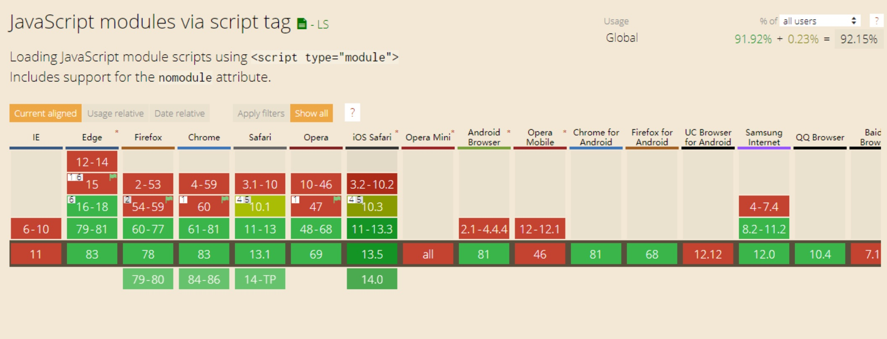

- [vite](#vite)
    - [简介](#简介)
    - [如何使用](#如何使用)
    - [原理](#原理)
    - [项目中应用](#项目中应用)
    - [参考](#参考)
# vite

### 简介

> vite 是一个不需要打包的开发阶段的服务器，在生产阶段使用 rollup 进行构建。具有以下特点：
>
> - 快速的冷启动
> - 模块热更新
> - 真正的按需编译

### 如何使用


```shell
# vue3.x
$ npm init vite-app <project-name>
$ cd <project-name>
$ npm install
$ npm run dev

# react
npm init vite-app --template react

# preact
npm init vite-app --template preact
```

### 原理
vite原理是基于[ES模块](https://developer.mozilla.org/en-US/docs/Web/JavaScript/Reference/Statements/import)，浏览器对模块化的支持参差不齐，这决定了vite的模式只能用于开发阶段。现代浏览器是如何支持es模块的，形式上只需要将内容通过带有`type="module"`属性的`script`标签引入，在该`script`标签内就能使用`import` `export`语法了。需要注意的是，import的模块将使用http形式获取。



```html
<script type="module">
  import { add } from './a.js'
  a(1,2)
</script>
```

`在不编译的前提下，使用浏览器模块化如何解决项目遇到的问题：`

1. 三方模块, es module 无法解析非相对路径的模块，必须符合三种路径格式`/`，`./`，`../`。vite 的解决思路是统一给模块加上`/@module/`前缀
2. 样式怎么解决
3. 路径别名
4. 环境变量
5. typescript
6. 模块热更新

```js
// import { createApp } from "vue"
import { createApp } from "/@module/vue";
```

配合es module的网络请求


流程图


`cli:`
构建服务

```ts
(async () => {
  const { help, h, mode, m, version, v } = argv;
  const envMode = mode || m || defaultMode;
  const options = await resolveOptions(envMode);
  if (!options.command || options.command === "serve") {
    // 开发阶段启动服务
    runServe(options);
  } else if (options.command === "build") {
    runBuild(options);
  } else if (options.command === "optimize") {
    runOptimize(options);
  } else {
    console.error(chalk.red(`unknown command: ${options.command}`));
    process.exit(1);
  }
})();

async function runServe(options: UserConfig) {
  const server = require("./server").createServer(options);

  let port = options.port || 3000;
  let hostname = options.hostname || "localhost";
  const protocol = options.https ? "https" : "http";

  server.listen(port, () => {
    console.log(`  Dev server running at:`);
    const interfaces = os.networkInterfaces();
    console.log();
    require("debug")("vite:server")(`server ready in ${Date.now() - start}ms.`);
  });
}
```

### 项目中应用
还在beta阶段，不建议线上使用，个人项目积极推荐，开发很爽

### 参考

1. [深入 vite 原理](https://www.tuicool.com/articles/EFJvEjf)
2. [vite HMR 原理](https://juejin.im/post/5f0b419ff265da22bf12be56)
3. [vite 如何做到让 vue 本地开发更快速](https://developer.aliyun.com/article/761551)
